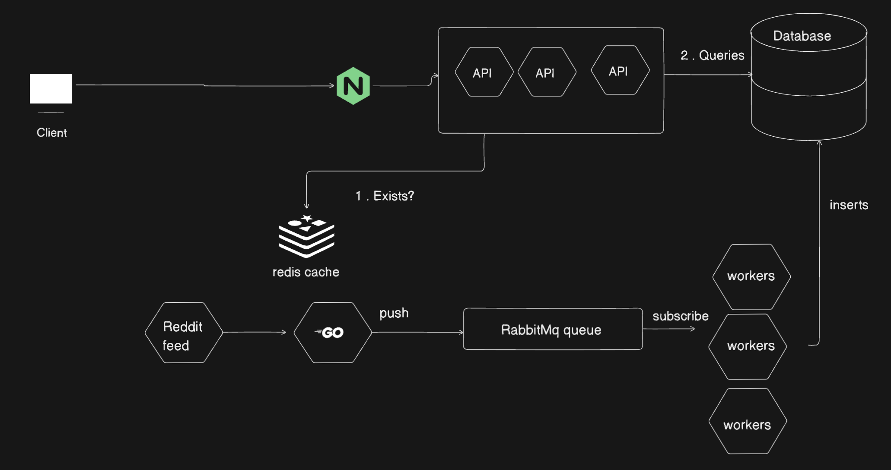

# Reddit Recpie API

This is a distrubuted web server runs through reddit like a crawler and finds recipes and takes users recipes with details like name instructions , ingredients and tags. Hence out database current list of local list of dishes and delicaes.

The system consists of three parts

- api i.e RESTful API
- rss parser i.e producer and consumer
- frontend
  We have integrated a circle ci pipeline to run tests , integrate and deploy major or minor changes to aws server .

## Architecture design



## Running the server Locally

To run this sevrices docker needs to be installed locally

```
cd  api
docker build -t recipes-api .
docker compose up -d
```

The request are routed by an ngnix server
for all Recipes - GET method

```
localhost/api/v1/recipes
```

For a full list of routes and json formats

```
localhost/api/v1/swagger/index.html
```
